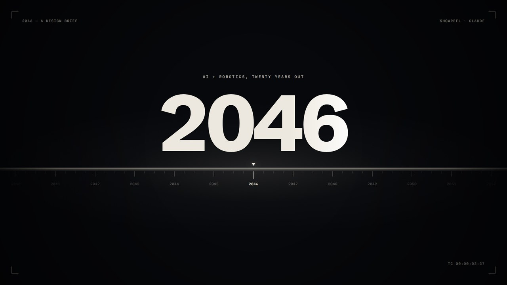
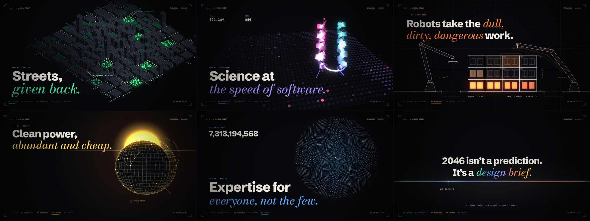

# 2046: A Design Brief



A 30-second showreel (1920×1080, 60 fps) imagining the world twenty years into AI and robotics. Every frame is drawn in plain JavaScript on an HTML canvas, and the score is synthesized in Python. The whole piece is a pure function of time `t`, so the MP4, the web player and the soundtrack all run on one clock.



## Build it

Requirements: Python 3.10+, ffmpeg (with libx264 and libmp3lame), and:

```
pip install numpy scipy pillow playwright
playwright install chromium
```

Then:

```
./build_all.sh
```

That rebuilds everything into `out/`: `2046_showreel.mp4` and `2046-showreel-player.html`. It takes about 5 minutes on 2 CPU cores, most of it rendering 1,800 frames.

## What's where

| Path | What it does |
|---|---|
| `src/core.js` | Shared toolkit: easing, seeded randomness, colour, the kinetic type system (masked word reveals, per-letter italic write-on, decoding mono labels, callouts), and a small 3D camera. |
| `src/s0_intro.js` | Cold open: a point becomes the horizon, the horizon becomes a timeline, and the odometer rolls from 2026 to 2046. |
| `src/s1_cities.js` | Isometric city with depth-sorted buildings, autonomous traffic platoons drawn as light, and parking lots that flip over into parks. |
| `src/s2_discovery.js` | A 1536-well plate (rows A–AF, columns 1–48) runs experiments in waves, while a protein folds into a four-helix bundle. It is drawn as a shaded ribbon from a Catmull-Rom spline. |
| `src/s3_robotics.js` | Technical elevation drawing. Two arms, solved with 2-link inverse kinematics, place one module every eighth note. |
| `src/s4_energy.js` | Sunrise over a solar field. The field curls into a sphere (continuous curvature from 0 to 1/R), rolls to face the camera, then the camera dives into one node. |
| `src/s5_access.js` | One person with a tutor, a doctor and a collaborator, then a zoom out to 4,200 people in a phyllotaxis spiral. |
| `src/s6_finale.js` | The chapter colours stream back into a spectrum horizon, and the brief's open questions appear. |
| `src/main.js` | Compositor: transitions (slit, strips, diagonal wipe, iris, crossfades), bloom, HUD, grain and vignette. Exposes `REEL.init`, `REEL.render(t)` and `REEL.events()`. |
| `build.py` | Concatenates `src/` into `dist/reel.js`. |
| `render.html` | Headless page that loads the fonts and the bundle. Open it in a browser and call `REEL.render(12.5)` in the console to see any moment. |
| `render_frames.py` | Renders every frame to JPEG with Playwright, using two parallel pages. |
| `export_events.py` | Pulls event times out of the renderer into `events.json`: cuts, odometer ticks, robot locks, well-plate hits and streak landings. |
| `synth.py` | The score, built from numpy oscillators, noise, filters, a convolution reverb and a limiter. It is timed from `events.json`, so sound lands on picture. |
| `master_audio.sh` | Normalises loudness to -14 LUFS with a -1.5 dBTP true peak, and makes an MP3 for the player. |
| `encode.sh` | Encodes H.264 High (BT.709, CRF 17) with AAC audio. |
| `player_src.html`, `build_player.py` | The interactive player. The build step inlines the fonts, the renderer and the audio into one HTML file. |
| `preview.py` | Contact sheet of any timestamps, for example `python3 preview.py out/sheet.png 4.5 12.3 19.0`. |
| `analyze_audio.py` | Loudness, band balance and spectral tilt report for the mix. |
| `fonts/` | Schibsted Grotesk, Bodoni Moda Italic and Martian Mono, all under the SIL Open Font License (see the `LICENSE-*` files). |

## Changing things

- **Timing.** Each scene has a `t0`/`t1` window and its own keyframe times. Transitions live in `TR` in `src/main.js`. If you move an event that has a sound, run `python3 export_events.py` then `python3 synth.py` so the score follows.
- **Copy.** Headlines are built with `mkLine(...)` in each scene's `init`. The HUD and end card text live in `src/main.js` and `src/s6_finale.js`.
- **Colours.** The palette is in `C` and `CHAPTERS` in `src/core.js`.
- **Grain.** `REEL.OPTS.grain` controls it. The live player keeps animated grain on. The MP4 is rendered without grain (`#nograin`), because moving grain pushed the bitrate from about 7 to about 100 Mbps.

## Instagram Reels cut

`reels/` builds a 1080×1920 version for Instagram: a 4-second hook in the same type system, then the reel letterboxed between black bars.

```
./reels/build_reels.sh
```

That writes `out/reels/2046_reels_1080x1920.mp4` (30 fps, H.264 with AAC at 48 kHz) and a matching cover image, in about 4 minutes on 2 CPU cores.

| Path | What it does |
|---|---|
| `reels/hook.js` | The hook: "No After Effects. No video model. No stock music. Just code, written by Claude." It ends with letterbox bars closing around a point of light, exactly where the reel's first spark appears. |
| `reels/reels.html` | Compositor: draws the hook, then the reel scaled into the band between the bars. |
| `reels/build_hook.py` | Bundles `src/core.js`, a slice of the reel's own source (the code that scrolls behind "Just code,"), and `hook.js` into `dist/hook.js`. |
| `reels/hook_synth.py` | The hook's music on the reel's 120 BPM grid, built from the instruments in `synth.py`. It resolves into the reel's opening chord, lays the reel's score in at 4 s, and limits the whole program. |
| `reels/render_reels.py`, `reels/encode_reels.sh` | Frame capture (1,020 frames) and the Instagram encode. |
| `reels/preview_reels.py` | Contact sheet of any timestamps in the 9:16 cut, for example `python3 reels/preview_reels.py out/reels/sheet.png 1.0 3.0 12.0`. |

## License

The code is MIT licensed (see `LICENSE`). The fonts in `fonts/` keep their own SIL Open Font License, included alongside them.
